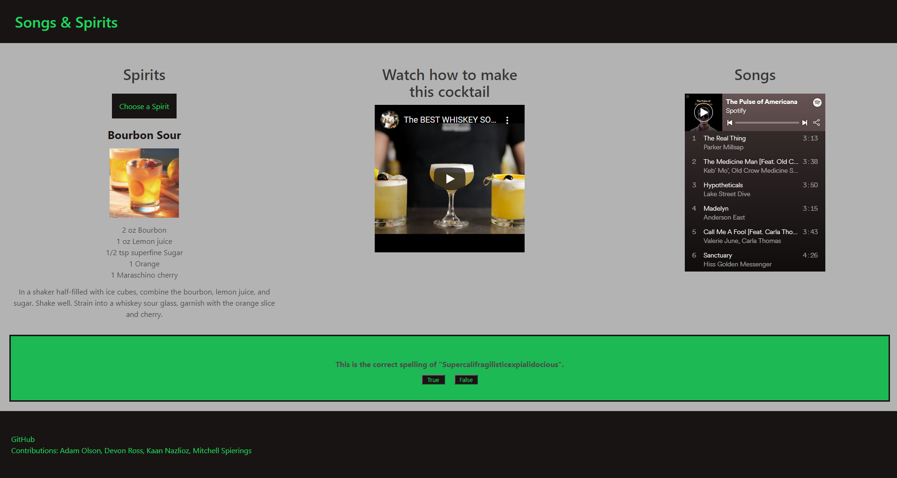

Group Project 1

Purpose:
A website user interactive website that randomly generates various cocktails from a pre set selection of 6 liquor types, with a Spotify Playlist to listen to while making/consuming cocktails. A trivia feature is also included for an added user experience while consuming cocktails & listening to the generated Spotify Playlists. 

Description:

Screenshot of completed website

Built With:
HTML
CSS
Javascript
Jquery
Bulma

Website

Git Repo Link
https://github.com/adamlsn/project1
